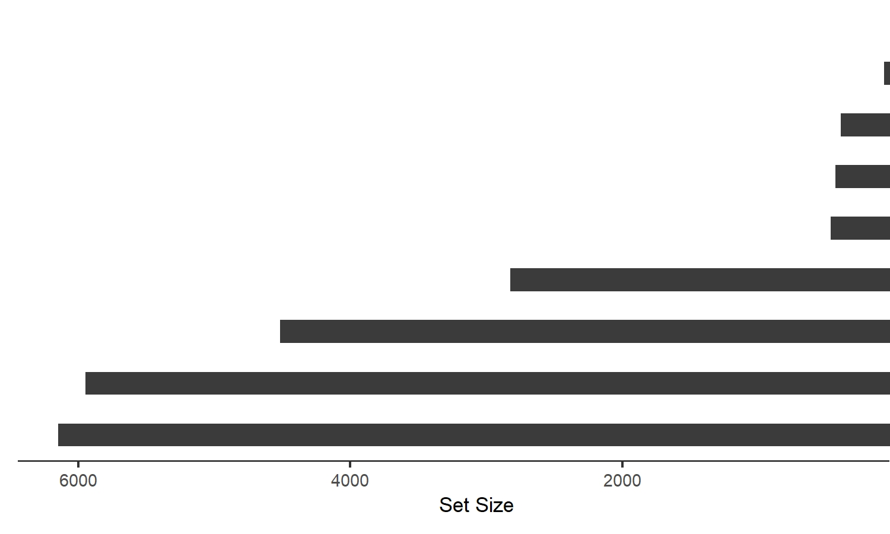
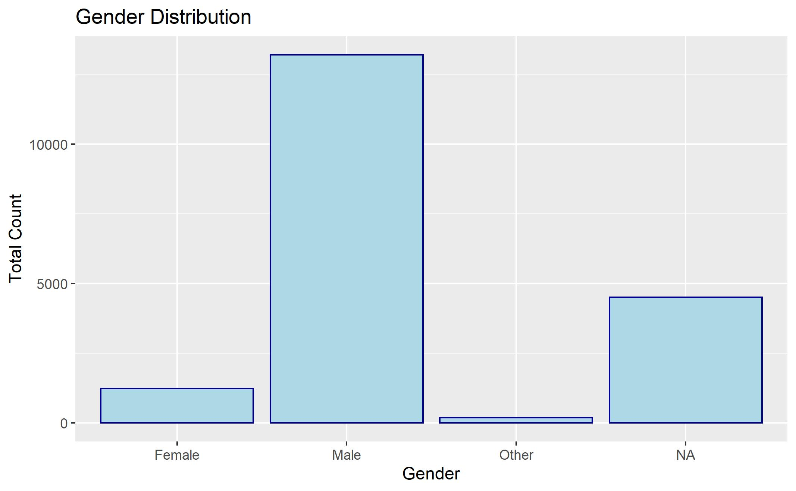
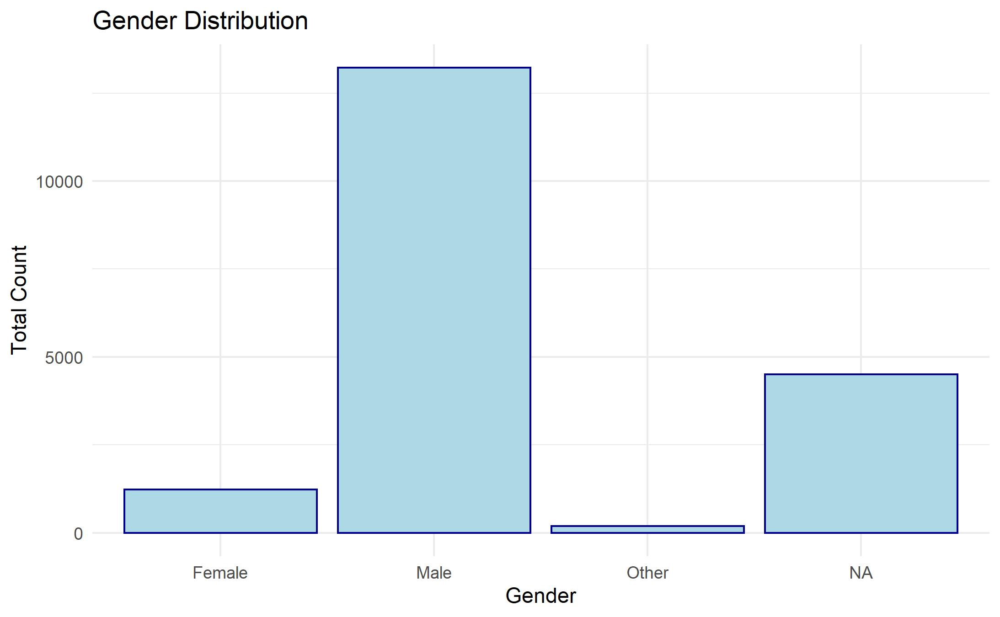
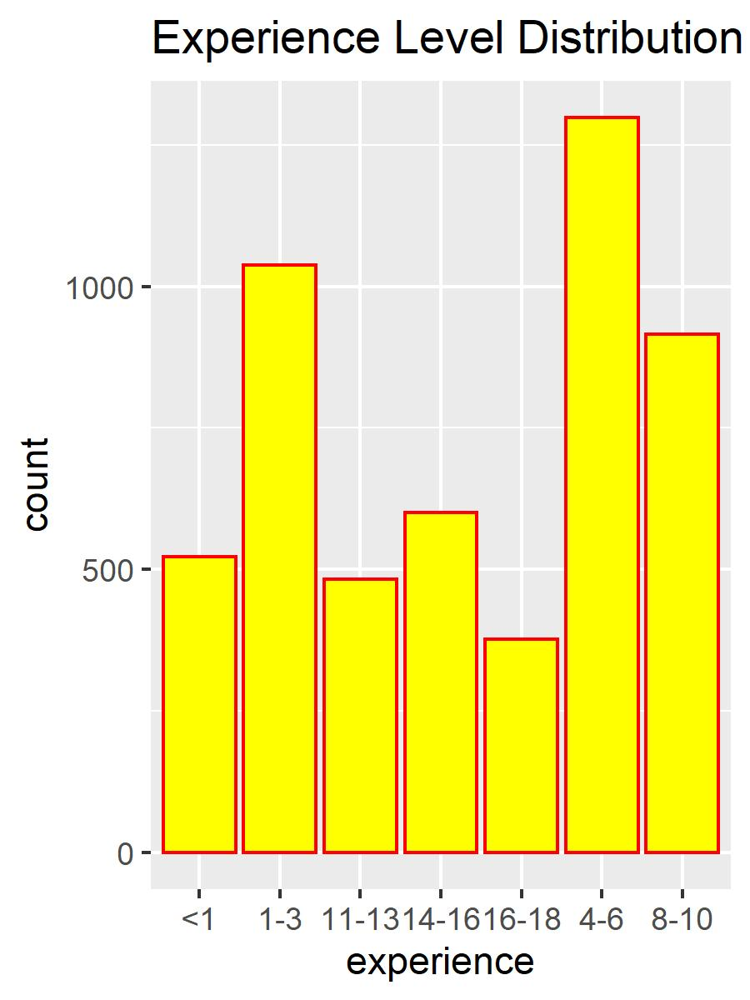
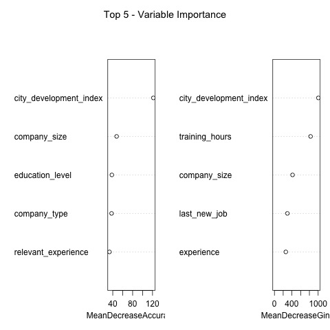
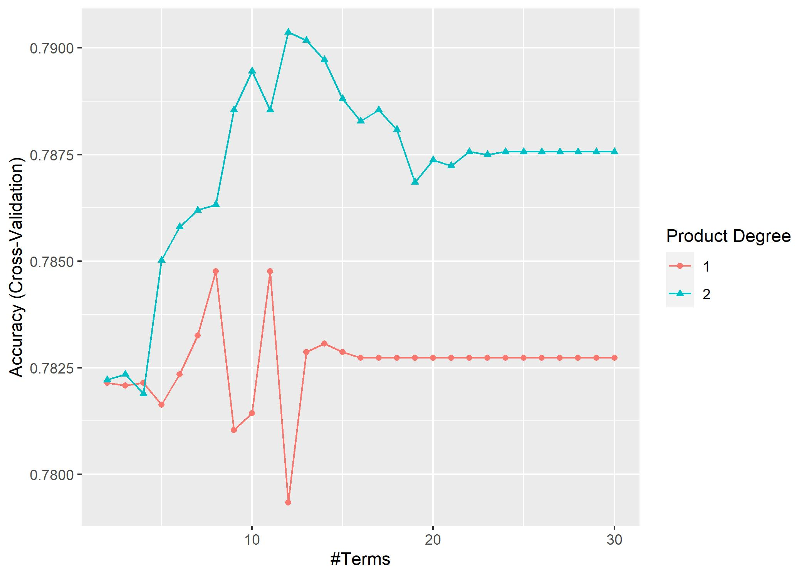
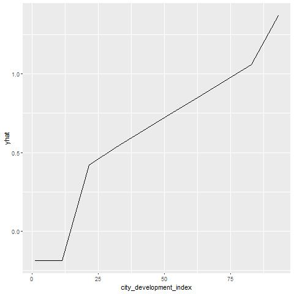
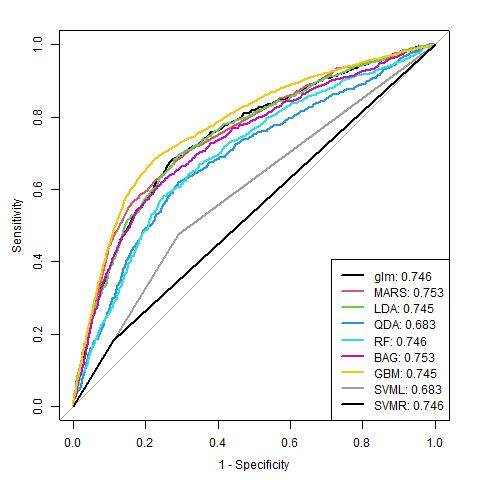

---
title: "Midterm_yutian"
author: "Yutian Luo"
output:
  pdf_document:
    toc: no
    toc_depth: 2
  html_document:
    df_print: paged
    toc: yes
    toc_depth: '2'
header-includes:
- \usepackage{fancyhdr}
- \usepackage{lipsum}
- \pagestyle{fancy}
- \fancyhead[R]{\thepage}
- \fancypagestyle{plain}{\pagestyle{fancy}}
--- 

```{r setup, include=FALSE}
knitr::opts_chunk$set(out.width="400px", dpi=120)

library(tidyverse)
library(janitor)
library(scales)
library(caret)
library(missForest)
library(ggplot2)
library(naniar)
library(arsenal)

library(ISLR)
library(glmnet)
library(mlbench)
library(pROC)
library(pdp)
library(vip)
library(AppliedPredictiveModeling)
library(klaR)
library(gridExtra)
library(png)
```

```{r, include=FALSE}

df_train = read.csv(file = 'aug_train.csv', na.strings = "")

df_train <-
  df_train %>% rename(relevant_experience = relevent_experience) %>%
  mutate(
    relevant_experience = str_replace(
      relevant_experience,
      pattern = "relevent",
      replacement = "relevant"
    )
  ) %>%
  mutate_if(is.character, as.factor) %>% 
  mutate(target = as.factor(target)) %>% 
  mutate(city_development_index = as.factor(city_development_index)) 

df_train = 
  df_train %>% 
  mutate(
    experience = ifelse(experience == '<1', '<1', 
                      ifelse(experience == c('1','2','3'), '1-3', 
                      ifelse(experience == c('4','5','6'), '4-6', 
                      ifelse(experience == c('8','9','10'), '8-10',
                      ifelse(experience == c('11','12','13'), '11-13', 
                      ifelse(experience == c('14','15','16'), '14-16',
                      ifelse(experience == c('16','17','18'), '16-18','>18'
                      )))))))
  ) %>% 
  mutate(
    experience = as.factor(experience)
  )

indextrain = createDataPartition(y = df_train$target, 
                                 p = 0.8,
                                 list = FALSE)

aug_train_for_Im = 
  df_train[indextrain, ] %>%
  dplyr::select(-enrollee_id, -city, -gender ) %>%
  mutate(
    city_development_index = as.numeric(city_development_index),
    target = as.factor(target)) %>% 
  as.data.frame()
  
  
aug_test_for_Im = 
  df_train[-indextrain,] %>% 
  dplyr::select(-enrollee_id, -city, -gender ) %>%
  mutate(
    city_development_index = as.numeric(city_development_index)) %>% 
  as.data.frame()

set.seed(1)
TrainDataImputed <- missForest(xmis = aug_train_for_Im, maxiter = 2, ntree = 20)
TrainDataImputed <- TrainDataImputed$ximp

### test data imputation

set.seed(1)
TestDataImputed <- missForest(xmis = aug_test_for_Im, maxiter = 2, ntree = 20)
TestDataImputed <- TestDataImputed$ximp
TestDataImputed <- 
  TestDataImputed %>%
  mutate(city_development_index = as.numeric(city_development_index))

set.seed(1)
PartIndex <- createDataPartition(TrainDataImputed$target, 
                                  p = .75, 
                                  list = FALSE, 
                                  times = 1)
New_aug_Train <- TrainDataImputed[ PartIndex,]
aug_validation  <- TrainDataImputed[-PartIndex,]

```


# Introduction

Data scientist jobs are changing in a fast pace, more job positions are facing severe competitions. While job market depends on supply and demand, we wish to look at how the supply side of data scientist change. This project explores how and why data scientists start to look for a new job in their field.

# Dataset Exploratory analysis/visualization

## Overview

The data is originatd from https://www.kaggle.com/arashnic/hr-analytics-job-change-of-data-scientists. The original dataset was pre-partitioned with training data of 19158 observations with 14 variables and testing data of 2129 observations with 13 variables (without response variable `target`).   

The independent variables include `city`, `city development index`, `gender`, `relevant experience`, `education level`, `company type` and so on. Our goal is to construct classification and regression models to predict the possibility that a single candidate will look for a new job in the job market.  


## Data Exploratory

The potential problem in the default data is missing data. The original data has 7.7% of missing data.

From (**Fig. missing**), we see that most of missing data are from `company type`, `company size`, `gender`, and `major discipline`. If simply drop the observations missing these information, there will be bias and almost half of data will be eliminated. Thus, we need to consider possibility of imputation.

To perform imputation, we first check missing mechanism. From (**Fig. missing2**), we see the intersection and amount of missingness. As we can see, the largest amount of missing (2777) is when `company type` and `company size` are both missing, while the second largest amount of missing (2224) is when `gender` alone is missing. So we can see that most of the missing has to do with `company size` and `company type` not recorded and the same time.
 
  From (**Fig. Gender**) We can observe that the gender distribution is very uneven, the male count is about 3 times the female count. In this case, we should consider dropping gender as a variable.
  
  From (**Fig. Company**), each category is more evenly distributed in company size, and most interviewees are from private Ltd. this makes sense in in the job market.
  
  After reviewing these plots, we cannot see if the missingness is from a non-random element. It seems that for those who didn't record company size, they also weren't recorded for company type, this might be from recording error. Thus, the missingness from these three variables are assumed to have MAR relation. Thus, we continue to perform imputation.


# Models

In the following models, the included predictors are `r names(TrainDataImputed)[-11]`. The applied models were models including logistics regression, generalized additive model, multivariate adaptive regression spline model, Quadratic Discriminant Analysis and Linear Discriminant Analysis.

## Random Forest as a baseline model

 From random forest model, we achieved an accuracy of 0.80. From this model, we see that the most important variables contributing to the choice of seeking a job are     `city development index`, `company size`, `company type`, `relevant experience` and `education level`. During our training process, we used training set, validation set and testing set to train the model. The final model has 0.91 sensitivity and 0.45 specificity.


### Logistics Regression

In logistics regression, we achieved sensitivity in 0.7853 and specificity in 0.6290. The agreement between predictive value and true value, is 0.3184; we achieved a satisfactory ROC, which is 0.76. However, when setting initial p>0.5, the sensitivity is very low. 

### LDA Model

 For LDA, although for continuous features it has assumption on normality, our data is mainly categorical/classification problem. Thus, LDA's robustness in assumption takes an advantage here. In LDA model we achieved a 0.763 ROC. However, we should note that LDA is generally used when K>2 or n is small.


### QDA Model

 When Assuming the sum of Gaussian densities are in different covariance matrix, we use Quadratic Discriminant Analysis. In our case, we hope that LDA and QDA would have similar result and prediction. The QDA achieved a 0.698 ROC. 


### Multiple Adaptive Regression Splines(MARS)

We conducted a 5-fold cross validation to get the best tuning parameters of the MARS model. The tuning parameters of the model are the number of modeling parameters and the degree of interaction. We set the degree of interaction as 1 to 2 and the number of modeling parameters as 2 to 30 before cross validation. Then we found the best tunes for the model, `interaction degree = 2 and nprune = 23`, it achieved a ROC 0.770


## Model Comparison

We obtain testing data ROC for each model. By comparing the ROC and looking at accuracy, we selected the MARS model as our final model for predicting `target`. Since only random forest used training- validation set resampling, we will use it as a reference to compare with the selected model as below.

# Conclusion

As shown in our models, the most important variables are `city development index`, `relevant experience`, `company size`, `company type-public sector`, `company type-ngo` . And our final model's partial dependency plot for city development shows that when city development is between (0.10,0.25), data scientists tend to look for a job most aggressively, if the city is mid-developing city with an index between (0.20,0.80) the rate for job change is lower, but similar to those in high developing city(above 80). This trend is also in line with the result from random forest model. In addition, people with relevant experience, less higher education, and who works in small firms are less likely to change jobs.


# Imputed Training Data Summary

```{r message=FALSE, warning=FALSE, message=FALSE, echo=FALSE,include=FALSE}

# summary table
tableby.control(pval = FALSE)
table_one <- tableby(target ~ ., data = TrainDataImputed, pval = FALSE) 

```

```{r message=FALSE, warning=FALSE, message=FALSE, echo=FALSE}

knitr::kable(summary(table_one, title = "HR Data"))

```


<!--  -->
 <!-- __Fig. Missing Data Intersection Plot__ -->

<!--  -->
<!-- \center __Fig.gender and company type and size__ -->

<!--  -->
<!-- \center __Fig. company size and type__ -->

<!--  -->
<!-- \center __Fig. Candidate Experience Years__ -->


<!--  -->
<!-- \center __Fig. random forest top5 important variable__  -->


<!--  -->
<!-- \center __Fig. Mars fitting__  -->

<!--  -->
<!-- \center __Fig. mars partial plot__  -->

<!--   -->

<!-- \center __Fig. 5 Model Comparison__ -->


